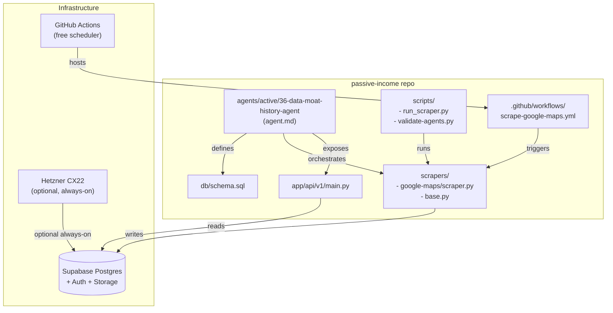

# System Design

## Data Flow

```mermaid
flowchart LR
    subgraph Scheduler["Scheduler"]
        GHA["GitHub Actions\ncron 03:00 UTC"]
        Cron["Local cron\n(optional)"]
    end

    subgraph Workers["Workers / Scrapers"]
        GM["google-maps scraper"]
        RTL["retailer scraper"]
        LLM["LLM / enrichment\n(future)"]
    end

    subgraph DB["Supabase Postgres"]
        SRC[sources]
        SNP[snapshots]
        EL[entity_latest]
        PH[price_history]
        PR[prospects]
        RV[reviews]
        MET[metrics]
        API_C[api_customers]
        API_U[api_usage]
    end

    subgraph API["FastAPI"]
        H[health]
        TS[/v1/timeseries]
        DS[/v1/datasets]
        PH_EP[/v1/price-history]
        LD[/v1/leads]
        RV_EP[/v1/reviews]
    end

    GHA --> GM
    Cron --> GM
    GHA --> RTL

    GM -->|writes| SNP
    GM -->|upserts| EL
    GM -->|registers| SRC

    RTL -->|writes| PH
    RTL -->|writes| SNP

    LLM -->|enriches| PR
    LLM -->|writes| RV

    SNP --> TS
    EL --> TS
    PH --> PH_EP
    PR --> LD
    RV --> RV_EP
    SRC --> API

    API_C --> API
    API_U --> API

    API -->|"customers /\nresellers /\ninternal tools"| OUT
```


